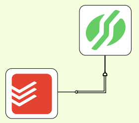

# Todo-Ist Sankhya Sync

Este é um projeto de integração entre o aplicativo Todo-Ist (ferramenta de gerenciamento de tarefas) e o ERP Sankhya. Ele sincroniza tarefas entre ambos os sistemas, buscando tarefas no Sankhya e inserindo-as no Todoist, atualizar tarefas já existentes no Todoist com base no progresso registrado no Sankhya além de concluir tarefas no todoIst assim que as mesma são finalizadas no sistema Sankhya.

 

## Pré requisitos
- Python 3.x `(Esta integração foi iniciada na versão 3.12, então não podemos garantir que funcione para versões anteriores.)`
- pip `para instalação de dependencias`

## Bibliotecas utilizadas
- logging
- dotenv
- todoist_api_python
- requests

## Instalação

1. __Download/clonagem do repositório__: Primeiramente precisamos realizar o download do repositorio no computador/servidor onde o mesmo sera executado. Para isso, podemos utilizar o comando

```bash
git clone https://github.com/luciano-soares/Todo-Ist_Sankhya_Sync.git
cd Todo-Ist_Sankhya_Sync.git
```

Ou clicar no botão __Download__ presente no repositório

2. __Instalando dependências__: Este projeto utiliza bibliotecas que não vem pré-instaladas com o python, sendo assim a necessidade de instala-lás manualmente.
O arquivo requirements.txt mostra uma lista completa de quais bibliotecas foram utilizadas e sua respectiva versão. Para instalar todos os pacotes presentes na lista, podemos executar o seguinte comando.

```bash
pip install -r requirements.txt
```

3. __Arquivo com todas os tokens/senhas__: Para que o projeto funcione corretamente, precisamos configurar os tokens, senhas e todas as informações sensíveis.
- Informações Sankhya: Do sistema sankhya, iremos precisar das seguintes informações:
  - Sankhya ID: Iremos precisar de um usuário sankhya ID cadastrado e vinculado ao sistema do cliente que deseja realizar a integração
  - Appkey: Gerado pela propria sankhya. Para realizar a criação, basta preencher o formulario "Dados de contato" no [site de clientes sankhya](https://www.sankhya.com.br/parceiros/#)
  - Token: Gerado na tela "Configurações Gatway", dentro do sistema sankhya. [Documentação para geração de token](https://ajuda.sankhya.com.br/hc/pt-br/articles/12226863277591-Como-gerar-o-TOKEN-API-de-Servi%C3%A7os-Gateway)
- Informações Todo-Ist: Do aplicativo Todo-Ist, iremos precisar das seguintes informações:
  - Token Todo-Ist: You can find your personal token in the [integrations settings view](https://todoist.com/prefs/integrations) of the Todoist web app and replace the token value in the samples
  - Id Projetos: Tento o token para realizar requisições com API do todo-ist, precisamos descobrir o código do projeto que iremos realizar a integração. Para localizar o id do projeto, podemos seguir a [documentação oficial do todo-ist](https://developer.todoist.com/rest/v2/#get-a-user-39-s-projects)

Tendo todos esses dados, podemos configurar o arquivo .env da seguinte maneira:

```
TODOIST_TOKEN=seu_token_todoist
TODOIST_PROJECT_ID=seu_id_projeto_todoist
SANKHYA_ID_USERNAME=seu_username
SANKHYA_PASSWORD=sua_senha
SANKHYA_TOKEN=seu_token_sankhya
SANKHYA_APPKEY=sua_appkey_sankhya
```

## Execução

### Execução manual
- Execução manual: Caso não queira executar o programa em um servidor ou queira apenas testa-ló, você pode executa-ló com o comando Python:
```
python src/main.py
```

### Execução contínua
Para automatizar a execução contínua do script, você pode configurá-lo para rodar em intervalos regulares:

- Windows: Para execução contínua no sistema windows, pode-se seguir o [tutorial oficial da microsoft](https://learn.microsoft.com/pt-br/troubleshoot/windows-server/system-management-components/schedule-server-process)
- Linux: Para execução contínua no Linux existem várias ferramentas para tal, porem fica como recomendação utilizar o crontab. Podemos configurar o crontab através deste [tutorial](https://medium.com/totvsdevelopers/entendendo-o-crontab-607bc9f00ed3) descrito no medium.

Os logs serão armazenados no arquivo logs/debug.log

## Personalização
Este projeto foi desenvolvido para executar buscando informações no sankhya flow. Caso queira que o mesmo integre informações de outros modulos no sistema sankhya, precisamos realizar duas alterações no projeto:

1.  __Consulta de dados__: Modifique a consulta SQL no arquivo `src/sankhya.py` para ajustar as informações buscadas do Sankhya.

2. __Cadastro/Consulta no Todo-Ist__: Alterações no padrão de sincronização com o Todoist podem ser feitas no arquivo `src/main.py`.